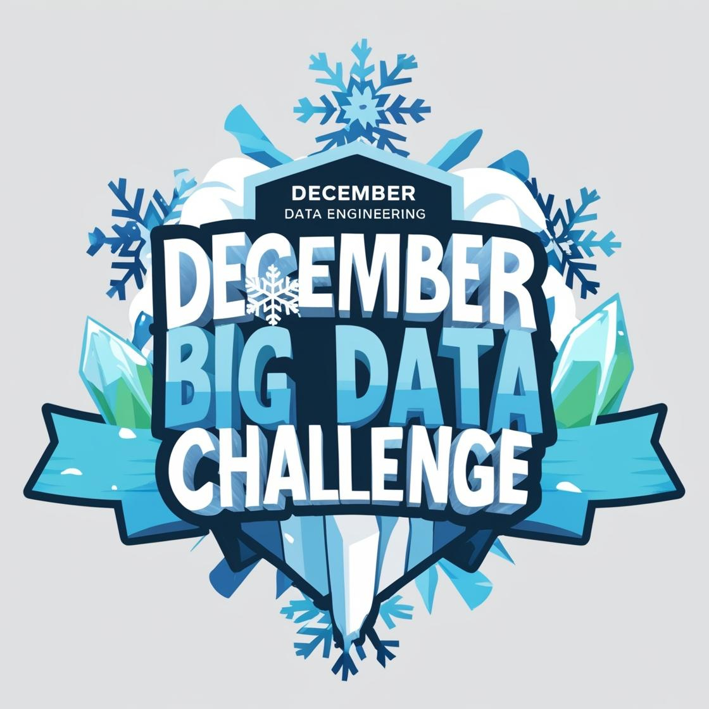

# ABD-december-big-data-challenge
Task's solutions of December challenge from Akademia Big Data

## Tasks
*all descriptions are in Polish because Akademia Big Data is a Polish platform for data engineers and enthusiasts of big data created by Marek Czuma*

- [Task 01 - Extract data](tasks/task_01.md)
- [Task 02 - Load data](tasks/task_02.md) 
- [Task 03 - Transform data](tasks/task_03.md)
- [Task 04 - Load data to DB](tasks/task_04.md)

## Installation

to be written...

## Used APIs
- [OpenWeatherMap API](https://openweathermap.org/api) - for getting weather data
- [Nominatim API](https://nominatim.org/release-docs/latest/api/Overview/) - for geocoding locations

### Used AI
I used Cursor with Antropic AI (Cloude 3.5) to generate commits messages and docstrings for this project.
