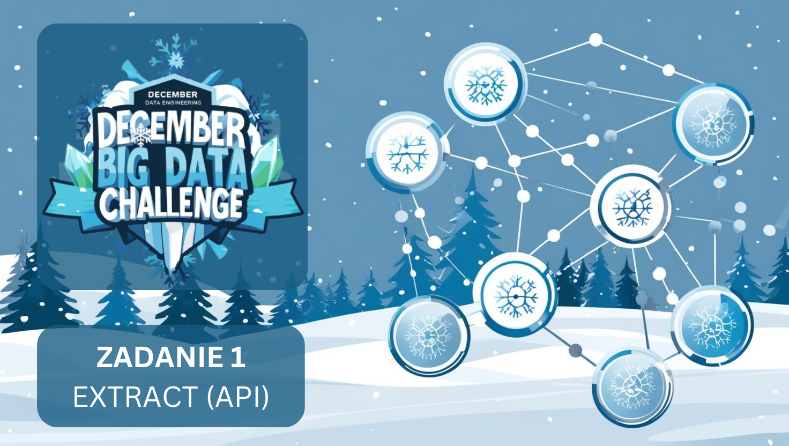

[English version](#basic-task-en)

# Podstawowe polecenie: 
Napisz aplikację, która pobiera dane z API pogodowego i zapisuje na dysk. Aplikacja powinna być parametryzowana, aby można było łatwo uruchomić, pobierając z różnych miast czy dat. W podstawie można zrobić pobieranie z określonych miast, z aktualnego momentu. Docelowo warto dodać też historię.

## Data zakończenia: 
10.12.2024

## Proponowane narzędzia: 
Scala, Python, biblioteki: requests (w obu przypadkach)

## Dodatkowo dla ambitnych:
 Całość można zapisywać na którymś z systemów plików, chmurowych lub on-premise. Proponowane to: HDFS, MinIO, AWS S3, Azure ADLS gen 2 (blob)

## Input (zasoby):
Link do proponowanego API pogodowego (można wybrać swoje), do tego dwa konkretne linki (wszystko w komentarzu)

## Uzasadnienie (co ćwiczymy i dlaczego):

1. Zapoznawanie się z API: Big Data to nie tylko logiczne transformacje. To także konieczność pracy z zewnętrznymi źródłami. Pierwszym etapem jest umiejętność wczytania się w to jak ktoś inny przygotował to co mamy pobrać.
2. Pobieranie z API: jak wyżej :-). Tyle, że tu już budujemy warsztat techniczny do pobierania danych.
3. Umiejętność budowania ETL (pierwszy etap – Extract).
4. Praca z surowymi danymi
5. Tworzenie kodu, który nie jest jednorazowym ćwiczeniem. Poprzez parametryzację chcemy dać możliwość wielokrotnego, a nawet częstego wykorzystania

---

## Basic task (EN)
Write an application that fetches data from a weather API and saves it to disk. The application should be parameterized so that it can be easily run to fetch data from different cities or dates. At a basic level, it can fetch data from specified cities at the current moment. Eventually, it's worth adding historical data as well.
## Completion date:
10.12.2024

## Suggested tools:
Scala, Python, libraries: requests (in both cases)

## Additional challenge:
The whole thing can be saved on one of the cloud or on-premise file systems. Suggested ones are: HDFS, MinIO, AWS S3, Azure ADLS gen 2 (blob)

## Input (resources):
Link to suggested weather API (you can choose your own), plus two specific links (all in comments)

## Rationale (what we're practicing and why):

1. Getting familiar with APIs: Big Data is not just about logical transformations. It also requires working with external sources. The first stage is being able to understand how someone else prepared what we need to fetch.
2. Fetching from APIs: as above :-). Except here we're building technical skills for data fetching.
3. Building ETL skills (first stage – Extract).
4. Working with raw data
5. Creating code that isn't just a one-time exercise. Through parameterization, we want to enable multiple and even frequent use

