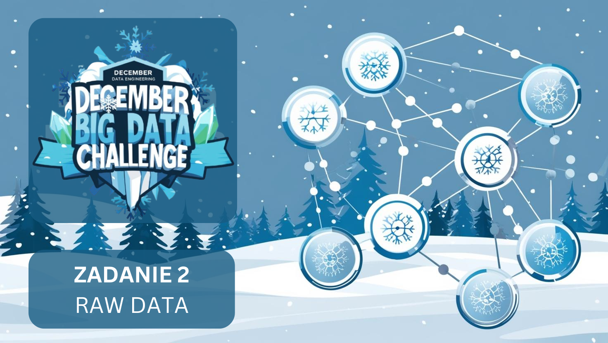

[English version](#basic-task-en)

# Podstawowe polecenie: 
Znakomicie! Mamy już surowe dane, które systematycznie spływają do odpowiednich miejsc w formie JSONów. Czas zamienić wiele plików JSON na przydatnego parqueta. Przygotuj aplikację sparkową, która wczytuje dane (pliki JSON) z określonego miejsca na dysku/storage’u, parsuje do “stanu używalności”, a następnie zapisuje do parqueta “final” w innym miejscu. W tym miejscu wszystkie dane ze wszystkich plików powinny być złożone do jednego.

## Data zakończenia:
15.12.2024

## Proponowane narzędzia:
Apache Spark (język obojętny)

## Dodatkowo dla ambitnych:
Można dodać na tym etapie dodatkowe dane – np. z jakiego miasta jest, lub jakie koordynaty zostały użyte do uzyskania danych (mogą się różnić). Dodatkowo warto wprowadzić metadane, typu “timestamp zapisu do parqueta itd.” Można też przemyśleć w jaki sposób zapisywać do pliku “final” tylko te dane, które doszły (te które już były powinny być niezmienione, np. z metadanymi czasowymi z wczesniejszych zapisów).

## Input (zasoby):
paczka z przykładowymi plikami JSON, dla tych którzy nie zrobili poprzedniego zadania.

## Uzasadnienie (co ćwiczymy i dlaczego):

Podstawa w tworzeniu systemu operowania na danych, to wciąganie surowych plików do naszego flow. Musimy zadać sobie pytania typu “jakiego schematu będę potrzebował na dalszym etapie?” czy “jakie metadane dodać?”
Dodatkowo ćwiczymy elementy architektury – należy się zastanowić w jaki sposób ułożyć napływające dane. I to niezależnie od tego czy docelowym miejscem zapisu jest nasz system plików na laptopie, HDFS czy AWS S3.

---

## Basic task (EN)
Excellent! We now have raw data that systematically flows into the appropriate locations in the form of JSON files. It’s time to convert multiple JSON files into a useful Parquet format. Prepare a Spark application that reads data (JSON files) from a specified location on disk/storage, parses it into a “usable state,” and then writes it to a “final” Parquet file in another location. At this point, all the data from all the files should be combined into one.

## Completion date:
15.12.2024

## Suggested tools:
Apache Spark (language is optional)

## Additional challenge:
At this stage, you can add additional data – for example, the city the data comes from or the coordinates used to obtain the data (these may vary). Additionally, consider adding metadata, such as the “timestamp of the Parquet write,” etc. You can also think about how to ensure that only new data is added to the “final” file while keeping the existing data unchanged (e.g., with previous metadata timestamps intact).

## Input (resources):
A package with sample JSON files for those who haven’t completed the previous task.

## Rationale (what we're practicing and why):
The foundation of building a data processing system is ingesting raw files into our workflow. We need to ask questions such as, “What schema will I need at a later stage?” or “What metadata should I add?”
Additionally, we practice elements of architecture – thinking about how to structure incoming data, regardless of whether the target storage is a local filesystem, HDFS, or AWS S3.